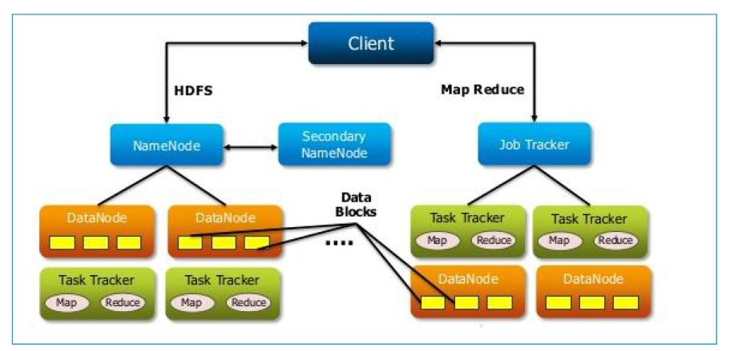
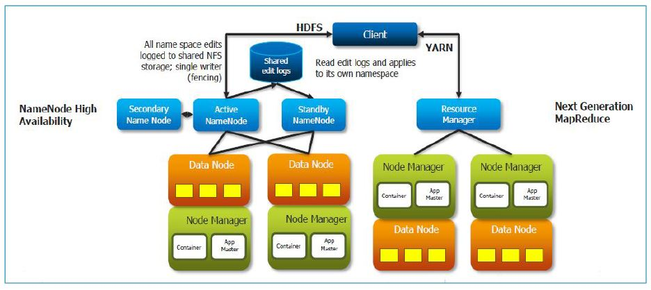
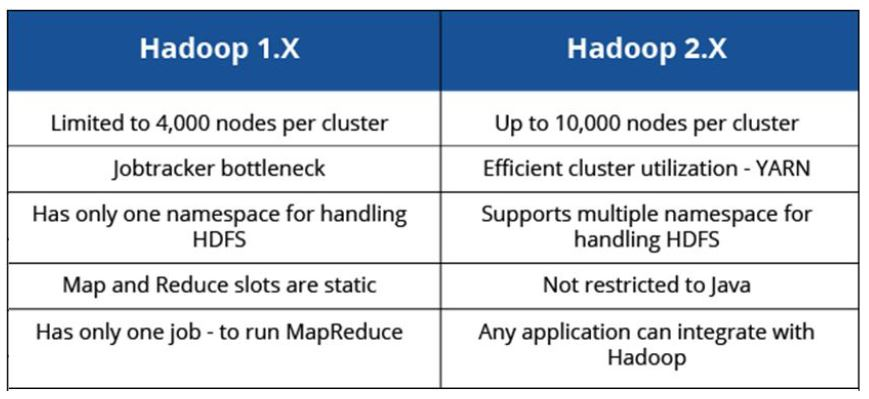
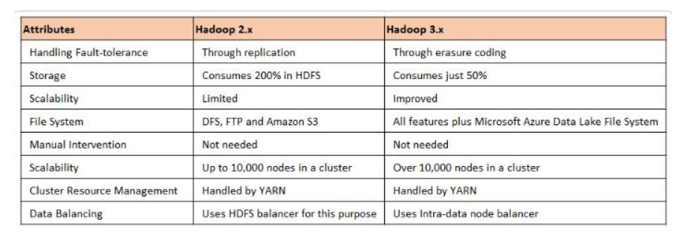
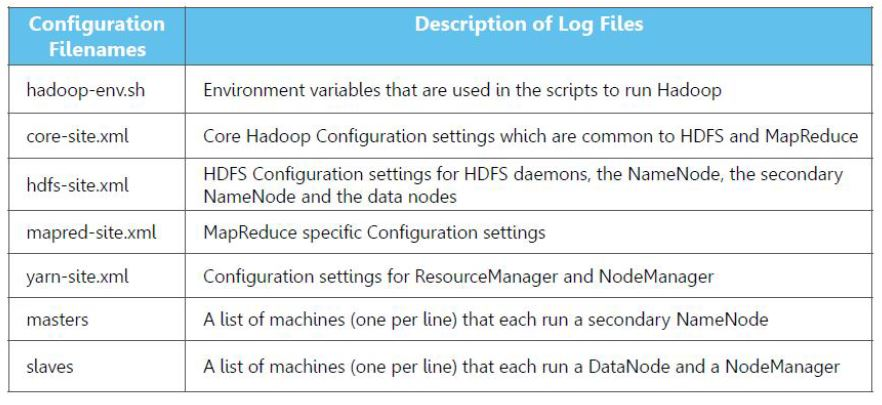
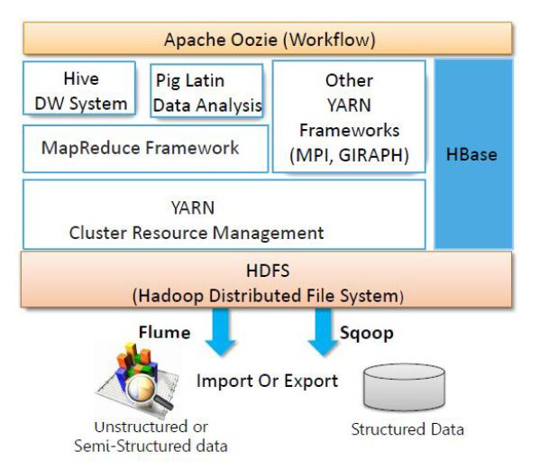
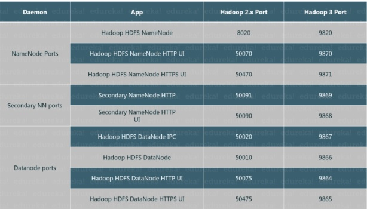

# Hadoop Hands On 
This document section deals with having a hands-on with `Hadoop` and the various tools in it.

Apache Hadoop is a framework that allows the distributed processing of large data sets across 
clusters of commodity computers using a simple programming model.

It is an Open-source Data Management with scale-out storage and distributed processing

---
## Reference to Reading Material 

1. [Introduction to Hadoop]() 
2. [HDFS](hdfs.md) 
3. [MapReduce & YARN](mapreduce.md) 
4. [Hive](hive.md) 
5. [Sqoop - Flume](sqoop-flume.md)

___

### A brief Introduction to Hadoop & It's Core Components

##### Hadoop Key Characteritics 

1. Reliable 
2. Scalable 
3. Economical 
4. Flexible 

##### Hadoop Architecture 

#### Hadoop Architecture 1.X 

- Clients (one or more) submit their work to Hadoop System.  
- When Hadoop System receives a client Request, it is received by a Master Node first.  
- Master Node’s MapReduce component `Job Tracker` is responsible for receiving the task from Client, dividing them into manageable independent Tasks and then assigning them to Task Trackers.  
- Slave Node’s MapReduce component “Task Tracker” receives those Tasks from “Job Tracker” and perform those tasks by using MapReduce components.  
- Once all task Trackers finish their job, Job Tracker takes those results and combines them into a final result which is finally sent to the client.  

> Hadoop 1.x Architecture has lot of limitations and drawbacks. So that Hadoop Community has evaluated and redesigned this Architecture into Hadoop 2.x Architecture.

##### Hadoop Core Components 1.X  

Hadoop is a system for large scale data processing. It has two main components: 

-HDFS 
    - Distributed across "nodes"
    - Natively reduntant
    - NameNode tracks location
    
-Map Reduce
    - Splits a task across Processors 
    - "near" the data & assembles Results 
    - Self-healing, High Bandwidth 
    - Clustered storage
    - JobTracker manages the TaskTrackers

[Reference](https://www.journaldev.com/8808/hadoop1-architecture-and-how-major-components-works#:~:text=Hadoop%201.x%20Components%20High%2DLevel%20Architecture&text=Master%20Node's%20HDFS%20component%20is,actual%20our%20application%20Big%20Data.)

---    
#### Hadoop Architecture 2.X 

Apache Hadoop 2.x Architecture is as in the diagram given below:

- Hadoop Common Module is a Hadoop Base API (A Jar file) for all Hadoop Components. All other components works on top of this module.
- HDFS stands for Hadoop Distributed File System. It is used as a Distributed Storage System in Hadoop Architecture.
- YARN stands for Yet Another Resource Negotiator. 
- MapReduce is a Batch Processing or Distributed Data Processing Module. 

>When compared to Hadoop 1.x, Hadoop 2.x Architecture is designed completely different. It has added one new component : YARN and also updated HDFS and MapReduce component’s Responsibilities.

###### Hadoop Architecture 2.X Core Components 
All Hadoop Ecosystem components work on top of these three major components:

- [HDFS](hdfs.md) 
- YARN 
- [Map Reduce](mapreduce.md)      

Hadoop 2.x components follow this architecture to interact with each other and to work in parallel in a reliable, highly available and fault-tolerant manner.

- All Master Nodes and Slave Nodes contains both MapReduce and HDFS Components.
- One Master Node has two components:
    - Resource Manager(YARN)
    - HDFS

It’s HDFS component is also knows as NameNode. It’s the NameNode which is used to store `Meta Data`.

- In Hadoop 2.x, some more Nodes acts as Master Nodes. Each this 2nd level Master Node has 3 components:
    - Node Manager
    - Application Master
    - Data Node

- These 2nd level Master Node again contains one or more Slave Nodes. These Slave Nodes have two components:
    - Node Manager
    - HDFS
    
It’s HDFS component is also knows as Data Node. It’s Data Node component which is used to store actual application data. These nodes does not contain Application Master component.

###### Difference between Hadoop 1.X & Hadoop 2.X

**More with Hadoop 3.X**

###### More On Hadoop Configuration

 

#### Hadoop Ecosystem 

###### Hadoop  Modes 

1. Standalone Or Local Mode
    - No Hadoop Daemons, entire process runs in a single JVM 
    - Suitable for running MapReduce programs during development
    - Has no DFS access
2. Pseudo-Distributed Model 
    - Hadoop Daemons Up, but on a Single Machine  
3. Fully Distributed/Clustered/Prod Mode
    - Hadoop Daemons run on a cluster of machines
___
# Notes for Installation 

___
## Quick Pointers 

- Hadoop Basics
- HDFS (Distributed Data Storage)
    - NameNode
    - SecondaryNameNode
    - DataNode
- Data 
    - Blocks
    - Unit Distribution and Replication
- MR (Distributed Data Processing)
    - Input => Splits => Mapper(Map Side Join) => Combiner => Shuffler & Sort(Reduce Side Join) => Partitioner => Reducer => Output				                                         
    - Distributed Cache		
- Hive
    - Provides SQL interface to analyse data
    - Hive on MR
    - Hive on Spark
    - Database/Schema => Tables [Managed Table, External Table, Partitioned Table, Bucketed/Clustered Table]
    - DDL, DML
    - JOINS - ALL
    - VIEWS
    - TRANSACTIONS - BY DEFAULT NO. POSSSIBLE IF WE CREATE TRANSACTIONAL TABLE
    - UDF - User Defined Function -> one to one  
    - UDAF - User Defined Aggregate Function -> many to one -> avg, count, sum
- Sqoop
    - Data Loading Tool
    - Structured Data
    - Bulk data transfer		
    - Sqoop Import
            - Source - RDBMS | DW
            - All Tables | Table | Query
            - Target - HDFS | Hive | HBase
    - Sqoop Export
            - Source  - HDFS | Hive | HBase
            - Target  - RDBMS | DW
- Flume
    - Unstructured
    - Streams
    - Source [FILE | MQ | API] => Channel => Sink [HDFS | KAFKA]