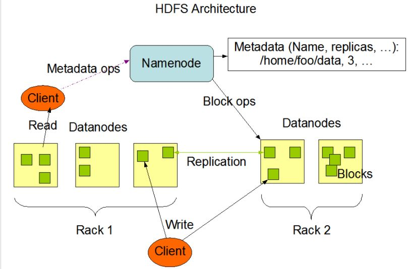
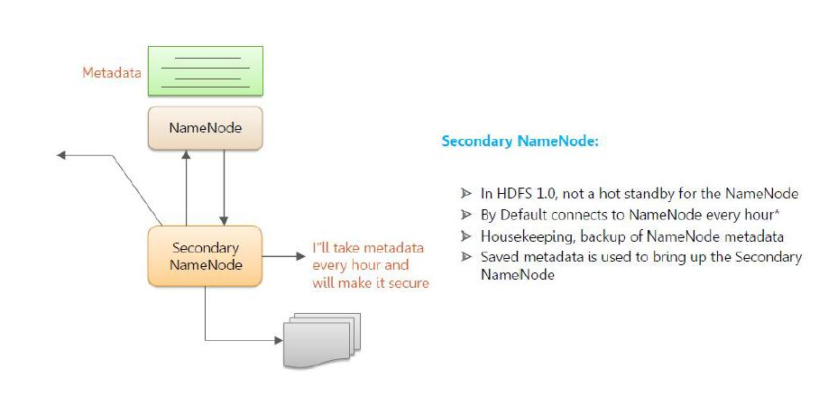
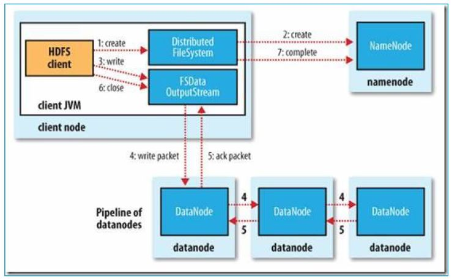
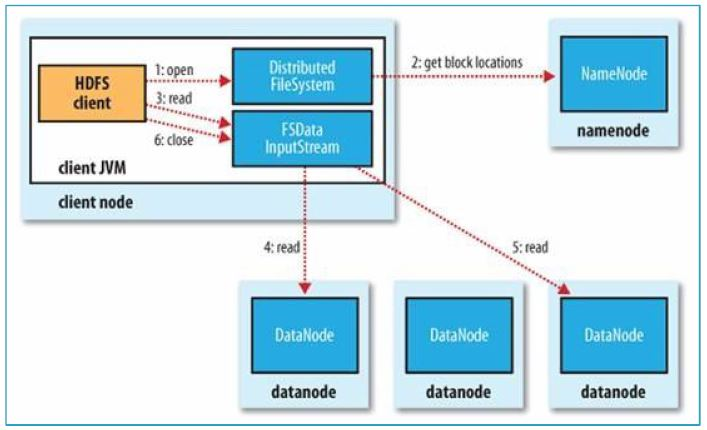
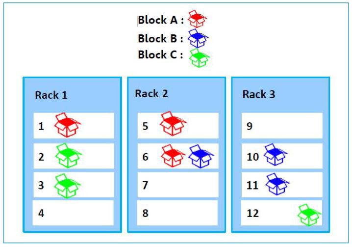
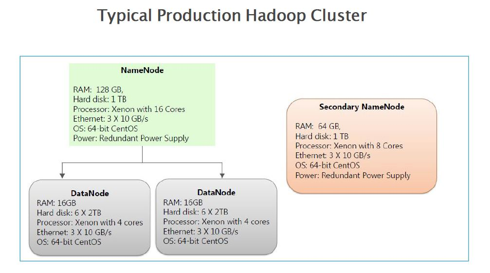

# HDFS - Hadoop Distributed File System 

### Index 

1.  HDFS Overview 
2.  HDFS Architecture 
3.  HDFS Components 
     - Name Node 
     - Secondary Name Node 
     - Data Node 
4.  HDFS File Write Anatomy 
5.  HDFS File Read Anatomy 
6.  Rack Awareness 
7.  Hadoop File Formats 
     - Text, Sequence, Avro, Parquet, ORC, etc
8.  Hadoop Compression Technique
9. Data Replication , Fault Tolerance, Resiliency, HA
        
        
### HDFS Overview & Architecture
The Hadoop Distributed File System (HDFS) is a distributed file system designed to run on commodity hardware. It has many similarities with existing distributed file systems. However, the differences from other distributed file systems are significant. HDFS is highly fault-tolerant and is designed to be deployed on low-cost hardware. HDFS provides high throughput access to application data and is suitable for applications that have large data sets. 
         
### HDFS Components 

#### NameNode & Data Nodes 
HDFS has a master/slave architecture. An HDFS cluster consists of a single NameNode, a master server that manages the file system namespace and regulates access to files by clients. In addition, there are a number of DataNodes, usually one per node in the cluster, which manages storage attached to the nodes that they run on. HDFS exposes a file system namespace and allows user data to be stored in files. Internally, a file is split into one or more blocks and these blocks are stored in a set of DataNodes. The NameNode executes file system namespace operations like opening, closing, and renaming files and directories. It also determines the mapping of blocks to DataNodes. The DataNodes are responsible for serving read and write requests from the file system’s clients. The DataNodes also perform block creation, deletion, and replication upon instruction from the NameNode.

 
 
The NameNode and DataNode are pieces of software designed to run on commodity machines. These machines typically run a GNU/Linux operating system (OS). HDFS is built using the Java language; any machine that supports Java can run the NameNode or the DataNode software. Usage of the highly portable Java language means that HDFS can be deployed on a wide range of machines. A typical deployment has a dedicated machine that runs only the NameNode software. Each of the other machines in the cluster runs one instance of the DataNode software. The architecture does not preclude running multiple DataNodes on the same machine but in a real deployment that is rarely the case.

The existence of a single NameNode in a cluster greatly simplifies the architecture of the system. The NameNode is the arbitrator and repository for all HDFS metadata. The system is designed in such a way that user data never flows through the NameNode.

##### Quick Points on Name Node 

- Keeps Meta data in Main Memory 
    - The entire metadata is in main memory 
    - File System meta-data is not loaded from hard disk
    
- Metadata Type
    - Files in HDFS 
    - Data Blocks for each file 
    - DataNodes from each block 
    - File attributes, e.g. access time, replication factor, access control    

- Transaction log 
    - Records file creations, file deletions, etc. 
    
- NameNode 
    - Keeps track of overall file directory structure and the placement of data block.
    
#### Secodary name Node
    

    

### Blocks in HDFS 
Block is nothing but the smallest unit of storage on a computer system. It is the smallest contiguous storage allocated to a file. In Hadoop, we have a default block size of 128MB or 256 MB.

### HDFS File Write Operation 

To write a file in HDFS, a client needs to interact with master i.e. namenode (master). Now namenode provides the address of the datanodes (slaves) on which client will start writing the data. Client directly writes data on the datanodes, now datanode will create data write pipeline.

### HDFS File Read Operation 

To read a file from HDFS, a client needs to interact with namenode (master) as namenode is the centerpiece of Hadoop cluster (it stores all the metadata i.e. data about the data). Now namenode checks for required privileges, if the client has sufficient privileges then namenode provides the address of the slaves where a file is stored. Now client will interact directly with the respective datanodes to read the data blocks.

        

### Rack Awareness in HDFS 
In a large Hadoop cluster, there are multiple racks. Each rack consists of DataNodes. Communication between the DataNodes on the same rack is more efficient as compared to the communication between DataNodes residing on different racks.

To reduce the network traffic during file read/write, NameNode chooses the closest DataNode for serving the client read/write request. NameNode maintains rack ids of each DataNode to achieve this rack information. This concept of choosing the closest DataNode based on the rack information is known as Rack Awareness.

A default Hadoop installation assumes that all the DataNodes reside on the same rack.

#### Why Rack Awareness?
The reasons for the Rack Awareness in Hadoop are:

- To reduce the network traffic while file read/write, which improves the cluster performance.
- To achieve fault tolerance, even when the rack goes down (discussed later in this article).
- Achieve high availability of data so that data is available even in unfavorable conditions.
- To reduce the latency, that is, to make the file read/write operations done with lower delay.
- NameNode uses a rack awareness algorithm while placing the replicas in HDFS.

#### Data Replication 

HDFS is designed to reliably store very large files across machines in a large cluster. It stores each file as a sequence of blocks. The blocks of a file are replicated for fault tolerance. The block size and replication factor are configurable per file.

All blocks in a file except the last block are the same size, while users can start a new block without filling out the last block to the configured block size after the support for variable length block was added to append and hsync.

An application can specify the number of replicas of a file. The replication factor can be specified at file creation time and can be changed later. Files in HDFS are write-once (except for appends and truncates) and have strictly one writer at any time.

To provide fault tolerance HDFS uses a replication technique. In that, it makes copies of the blocks and stores in on different DataNodes. Replication factor decides how many copies of the blocks get stored. It is 3 by default but we can configure to any value.

#### Fault Tolerance 
Fault tolerance in Hadoop HDFS refers to the working strength of a system in unfavorable conditions and how that system can handle such a situation.

HDFS is highly fault-tolerant. Before Hadoop 3, it handles faults by the process of replica creation. It creates a replica of users’ data on different machines in the HDFS cluster. So whenever if any machine in the cluster goes down, then data is accessible from other machines in which the same copy of data was created.

HDFS also maintains the replication factor by creating a replica of data on other available machines in the cluster if suddenly one machine fails.

## A Typical Production Hadoop Cluster 

[More On...](https://hadoop.apache.org/docs/current/hadoop-project-dist/hadoop-hdfs/HdfsDesign.html#:~:text=HDFS%20has%20a%20master%2Fslave,access%20to%20files%20by%20clients.) 

[More References](https://data-flair.training/blogs/hadoop-hdfs-tutorial/)