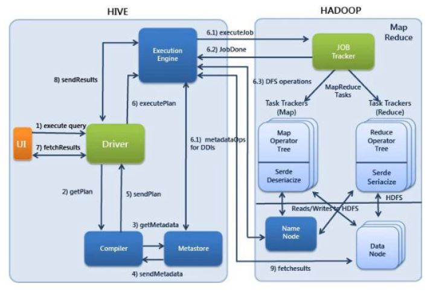

# Apache Hive 

The Apache Hive datawarehouse software facilitates reading, writing and managing large datasets residing in distributes storage using SQL. Structure can be projected onto data already in storage. A command line tool and JDBC driver are provided to connect users to Hive. 

## Outline 
1. Hive Overview
2. Hive Architecture 
3. Hive Data Types
4. Hive Tables 
5. HiveQL
6. Hive UDFs

## Hive Overview 

- Hive Originated as an internal project in Facebook 
- Later it was adapted in Apache as an open source project. 
- Facebook deals with massive amount of data (petabyte scale) and it needs to perform more than 75k ad-hoc queries on this massive amount of data. 
- Since the data is collected from multiple servers and is of diverse nature, any RDBMS system could not fit as probable solution. 
- Map Reduce could be a natural choice, but it had its own limitations. 

> What is Hive? 

- It is a query engine wrapper built on top of MapReduce
- It is treated as Data Warehousing tool of Hadoop Ecosystem
- It is used for data analysis. 
- Primarily targeted to the users with SQL background. 
- Provides HiveQL, which is very similar to SQL 
- It is used for managing and querying structure data. 
- Hadoop complexity is hidden from end users. 
- Java and Hadoop API knowledge is optional for core users. 

> Hive Use Cases 

> Hive Vs Pig 

> Hive Vs RDBMS 

Hive functionality seems quite near to a RDBMS, but there are subtle differences like: 
- Data in the RDBMS tables could be updated and deleted selectively, where as Hive doesn't support it. 
- Hive is `Schema-on-Read` system, where RDBMS systems are `Schema-on-Write` systems
- RDBMS tables are best suited for small to middle scale volume data (Early GBs max), whereas underlying data in HDFS tables typically of the order of several GBs to TB scale. 

> Limitations of Hive 

Hive is an excellent query engine on top of Hadoop but: 

- Hive typically suits for high latency queryies. The response of fastest Hive query is in the order of several seconds. 
- Hive does not support row level updates/deletes. Data can be either overwritten or appended. 
- Hive can not replace an OLTP system. 
- Hive does not offer real time queries capability. 

> Hive Components

## Hive Architecture

**Hive Metastore**

**Working of Hive**

## Hive Data Types

Hive data types can be further classified into Hive data types: 

### Hadoop Data Models 

## Hive & Beeline 

#### Hive 
Starting HIVE CLI 
> hive

Hive Command line options 

 
#### Beeline 

Starting Beeline CLI: 
>beeline

Connecting to embedded local hive server
>beeline>!connect jdbc:hive2:// username password 

Beeline Command Line Options

 

## Hive Tables

### Hive Managed Tables 

- By default we create the "managed" or "internal" tables in Hive
- They are called so as Hive manages their lifecycle 
- When a managed table is dropped, hive deletes the metadataas well as the data of the Table.
- Typically used to crate the user specific or group specific data. 

### Hive External Tables 

- Hive external tables are created using "external" keyword
- Hive just owns the metadata and `NOT` the actial data of the external tables. 
- When an external table is dropped, Hive deletes ONLY the metadata of the table. 
- Typically used to expose the enterprise wide data as tables for different groups. 

### Partitioned Tables 

Partition means dividing a table into coarse grained parts based on the value of a partition column such as a date, This makes it faster to do queries on slices of the data. 

### Bucketed Tables 

Buckets give extra structure to the data that may be used for more efficient queries. 

- A join of two tables that are bucketed on the same columns - including the join column can be implemented as a Map Side Join. 
- Bucketing by user ID means we can quickly evaluate a user based query by running it on a randomized sample of the total set of users. 

### Hive Views
- Hive supports creation of the views on underlying tables 
- A Hive view saves the query and treates it like a table 
- Hive view is a logical construct and does not store any data 
- VIews help in simplifying the complicated select queries 
- Hive executes the view query every time the view is queried
- Since Hive view queries are run every time wehn they are accessed a view may fail if underlying table(s) structure change. 

## HiveQL
#TODO 
## Hive UDFs
#TODO

___
### References 

[Apache Hive Official Doc](https://hive.apache.org/)