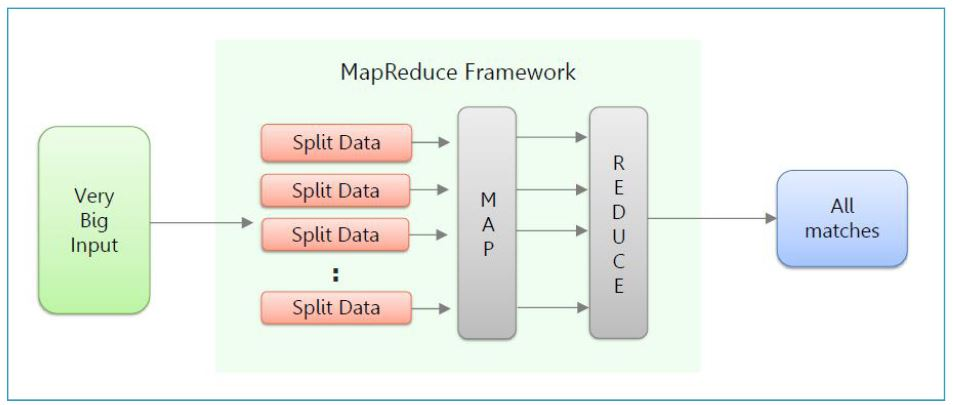
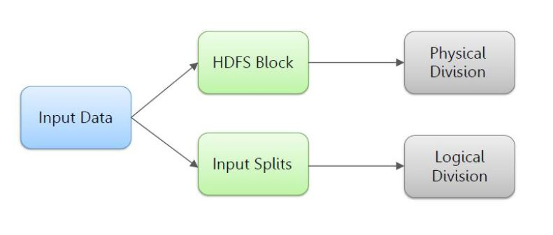
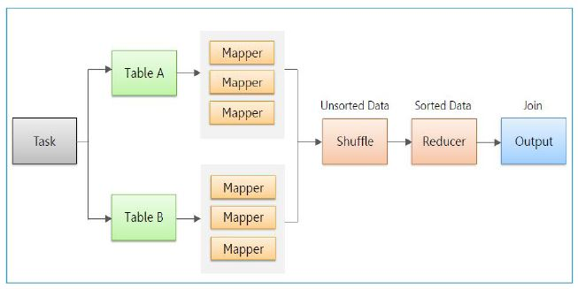

# Map Reduce Framework (MR)

## Index 

1. Map Reduce Overview & Architecture
2. MapReduce Concepts 
    - Splits
    - Mappers
    - Reducers
    - Partitioners
    - Combiners 
    - Counters
3. Input/Output File Formats
4. Map Side Join & Reduce Side Join
5. YARN Overview & Components 
    - Resource Manager 
    - Node Manager
    - Container 
    - App Master 
6. Job Scheduler

## Map Reduce Overview & Architecture 
MapReduce is the data processing layer of Hadoop. It is a software framework that allows you to write applications for processing a large amount of data. MapReduce runs these applications in parallel on a cluster of low-end machines. It does so in a reliable and fault-tolerant manner.

MapReduce job comprises a number of map tasks and reduces tasks. Each task works on a part of data. This distributes the load across the cluster. The function of Map tasks is to load, parse, transform and filter data. Each reduce task works on the sub-set of output from the map tasks. Reduce task applies grouping and aggregation to this intermediate data from the map tasks.

The input file for the MapReduce job exists on HDFS. The inputformat decides how to split the input file into input splits. Input split is nothing but a byte-oriented view of the chunk of the input file. This input split gets loaded by the map task. The map task runs on the node where the relevant data is present. The data need not move over the network and get processed locally.

**Traditionally this was the approach to solve a problem based on large dataset**

**Using Map Reduce, the solution becomes**

The two biggest advantages of Map Reduce are: 

- It takes processing to the data. 
- It allows processing of data in parallel.

**MapReduce Architecture**

**MR Process Flow**

### Input Splits 

## MapReduce Flow 

1. Input Data is present in datanodes. 
2. Map Tasks = Input Splits
3. Mappers Produce intermediate data 
4. Data is exchanged amoung nodes in `shuffling`
5. All data of same key goes to same reducer. 
6. Reducer output is dotred at output location. 

### Map Reduce Use cases 

1. Finding maximum stock market levels recorded in a span of 5 years
2. De-identify personal identifier information  

## MapReduce Concepts
The Data goes through the following phases: 

### Input Splits 
An input to a MapReduce job is divided into fixed-size pieces called input splits Input split is a chunk of the input that is consumed by a single map.

### Mapping 
This is the very first phase in the execution of map-reduce program. In this phase data in each split is passed to a mapping function to produce output values. In our example, a job of mapping phase is to count a number of occurrences of each word from input splits (more details about input-split is given below) and prepare a list in the form of <word, frequency>

#### Combiner
The combiner is actually a localized reducer which groups the data in the map phase. It is optional. Combiner takes the intermediate data from the mapper and aggregates them. It does so within the small scope of one mapper. In many situations, this decreases the amount of data needed to move over the network. For example, moving (Hello World, 1) three times consumes more network bandwidth than moving (Hello World, 3). Combiner provides extreme performance gain with no drawbacks. The combiner is not guaranteed to execute. Hence it is not of overall algorithm.

**Combiner In Action**

### Shuffling
This phase consumes the output of Mapping phase. Its task is to consolidate the relevant records from Mapping phase output. In our example, the same words are clubed together along with their respective frequency.

#### Partitioner
Partitioner pulls the intermediate key-value pairs from the mapper. It splits them into shards, one shard per reducer. By default, partitioner fetches the hashcode of the key. The partitioner performs modulus operation by a number of reducers: key.hashcode()%(number of reducers). This distributes the keyspace evenly over the reducers. It also ensures that key with the same value but from different mappers end up into the same reducer. The partitioned data gets written on the local file system from each map task. It waits there so that reducer can pull it.

### Reducing 
In this phase, output values from the Shuffling phase are aggregated. This phase combines values from Shuffling phase and returns a single output value. In short, this phase summarizes the complete dataset.

i. Shuffle & Sort   
The reducer starts with shuffle and sort step. This step downloads the data written by partitioner to the machine where reducer is running. This step sorts the individual data pieces into a large data list. The purpose of this sort is to collect the equivalent keys together. The framework does this so that we could iterate over it easily in the reduce task. This phase is not customizable. The framework handles everything automatically. However, the developer has control over how the keys get sorted and grouped through a comparator object.

ii. Reduce  
The reducer performs the reduce function once per key grouping. The framework passes the function key and an iterator object containing all the values pertaining to the key.

We can write reducer to filter, aggregate and combine data in a number of different ways. Once the reduce function gets finished it gives zero or more key-value pairs to the outputformat. Like map function, reduce function changes from job to job. As it is the core logic of the solution.

iii. Output Format  
This is the final step. It takes the key-value pair from the reducer and writes it to the file by recordwriter. By default, it separates the key and value by a tab and each record by a newline character. We can customize it to provide richer output format. But none the less final data gets written to HDFS.

### Map Side Join 

### Reduce Side Join

### Counters

- Counters are lightweight objects in Hadoop that allow you to keep track of system progress in both the map and reduce stages of processing. 
- Counters are used to gather infromation about the data wer are analysing, like how many types of records were processed, how many invalud records were found while running the job, and so on. 

### Distributed Cache

- At times, we might need to refer a relatively smaller amount of data in Map Reduce Jobs. 
- Map Reduce provides Distributed Cache facility. This allows to cache files (text, archives, jars, etc.) needed by applications. 
- FIles are copied only once pre job and should not be modified by the application or externally while the job is executing. 
- Both Mappers & Reducers can access these files. 
- DistributedCache can be used to distribute simple, read-only data/text files and/or more complex types such as archives, jars, etc via the JobConf.
- Programmer need to be careful to not use too many cache fiels. 
- The ideal size for distributed cache file is <= 100 to 150MB 

### Hadoop Input & Output Formats

**Hadoop Input Format**

**Hadoop Output Format**

**Hadoop Output Class Heirarchy**

## Hadoop File Formats

### Sequence Files 

**In HDFS** 
- SequenceFile is one of the solutions to small file problem in Hadoop 
- Small file is significantly smaller than the HDFS block size(128MB)
- Each file, directory, block in HDFS is represented as object and occupies 150 bytes. 
- 10 million files, would use about 3 gigabytes of memory of NameNode
- A billion files is not feasible

**In MapReduce**

- Map tasks usually process a block of input at a time(using default FileInputFormat). 
- The more the number of file is, the more number of Map task need and the job time can be much more slower. 

**Small File Scenarios**
- The files are pieces of a larger logical file. 
- The files are inherently small, for example images.
- The concept of sequence files is to put each small file to a larger single file. 
- For example, suppose there are 10,000 100KB files, then we can write a program to putthem into a single SequenceFile like below, where you can use filename to be the key and content to be the value. 
- Some beneftis: 
    1. A smaller number of memory needed on NameNode. Continue with the 10,000 100KB files example, 
        - Before using SequenceFile, 10,000 objects occupy about 4.5MB of RAM in NameNode
        - After using SequenceFile, 1GB SequenceFile with 8HDFS blocks, these objects occupy about 3.6KB of RAM in NameNode. 
    2. SequenceFile is splittable, so is suitable for MapReduce. 
    
### AVRO 

- Row based(store data in rows): row-based databases are best for write-heavy transactional workloads. 
- Support serialization 
- Fast binary format 
- Support block compression and splittable 
- Support schema evolution (The use of JSOn to describe the data, while using binary format to optimize storage size)  

- Stores the schema in the header of file so data is self describing.  

### Parquet 

- Column-oriented (store data in columns): column-oriented data sores are optimized for read-heavy analytical workloads.
- High compression rates(upto 75% with Snappy compression)
- Only required columns would be fetched.read (reducing the disk I/O)
- can be read and write using Avro API and Avro schema 
- Support predicate pushdown (reducing disk I/O cost)

### ORC (Optimized Row Columnar)

- Column-oriented data stores (store data in columns) are optimized for read-heavy analytical workloads
- High compression rates (ZLIB)
- Hive Type support (datetime, decimal and complex types like struct, list, map and union)
- Metadata stored using Protocol Buffers, which allows addition and removal of fields
- Compatible on HiveQL
- Support Serialization 

### File Format Comparison 

___     

## YARN (YET ANOTHER RESOURCE NEGOTIATOR) Overview & Architecture
YARN architecture basically separates resource management layer from the processing layer. In Hadoop 1.0 version, the responsibility of Job tracker is split between the resource manager and application manager.

YARN also allows different data processing engines like graph processing, interactive processing, stream processing as well as batch processing to run and process data stored in HDFS (Hadoop Distributed File System) thus making the system much more efficient. Through its various components, it can dynamically allocate various resources and schedule the application processing. For large volume data processing, it is quite necessary to manage the available resources properly so that every application can leverage them.

YARN Features:

- Scalability
- Compatibility 
- Cluster Utilization 
- Multi-tenancy 

### YARN Architecture 

The main components of YARN architecture include: 

- Client 
- Resource Manager (Master Daemon of YARN and is responsible for resource assignment and management.)
    - Scheduler (Performs Scheduling based on the allocated application and available resources)
    - Application Manager (Responsible for accepting the application and negotiating the first container from the resource manager.)
- Node Manager (Takes care of individual node on hadoop clister and manages application and workflow)  
- Application Master (Responsible for negotiating resources with the resource manager)
- Container (Collection of Physical resources such as RAM, CPU cores and disk on a single node.)

#### MR1 Vs YARN / MR2 Architecture 

### MR Job Execution YARN Flow 

**Workflow** 

1. Client submits an application
2. The Resource Manager allocates a container to start the Application Manager
3. The Application Manager registers itself with the Resource Manager
4. The Application Manager negotiates containers from the Resource Manager
5. The Application Manager notifies the Node Manager to launch containers
6. Application code is executed in the container
7. Client contacts Resource Manager/Application Manager to monitor application’s status
8. Once the processing is complete, the Application Manager un-registers with the Resource Manager

Resources: [GeeksforGeeks](https://www.geeksforgeeks.org/hadoop-yarn-architecture/)        
    