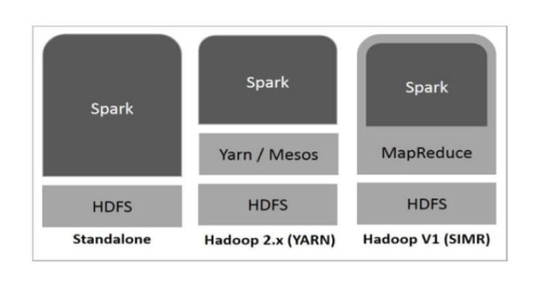
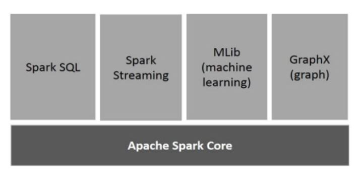
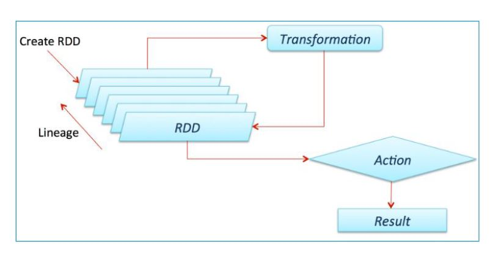
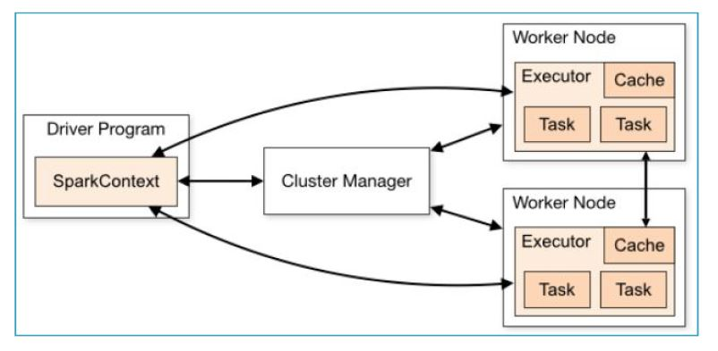

# Spark Hands On

### Outline

 - Introduction to Spark 
 - Map Reduce Vs Spark 
 - Spark Components 
 - RDD Overview 
 - Spark Architecture
 - Spark outline 

### Introduction to Spark 

> What is Spark? 
    
Apache Spark is a fast and generate engine for large-scale data processing.  
Spark is open source distributed computing engine for data processing and data analytics.   
It was originally developed at UC Berkely in 2009.   

> Spark On Hadoop 

> Spark Components 

### Map Reduce Vs Spark 

Map Reduce is an open-source framework for writing data into HDFS and processing structured and unstructured data present in HDFS. 
Map Reduce is limited to batch processing and on other Spark is able to do any type of processing. 
SPARK is an independent processing engine for real-time processing which can be installed on any Distributed File system like Hadoop. 
SPARK  provides a performance which is 10 times faster than Map Reduce on disk and 100 times faster than Map Reduce on a network in memory.

### Spark Modules

The Spark modules are as follows:  

- Spark Core => Spark Context
    Spark Core is the base engine for distributed task dispatching, scheduling, and basic I/O functionalities.
    Spark uses a specialized fundamental data structure known as RDD (Resilient Distributed Datasets) 
    that is a logical collection of data partitioned across machines.
    
- Spark SQL => Spark SQL Context, Spark Hive Context  
    Spark SQL is a Spark module for structured data processing. Unlike the basic Spark RDD API, the interfaces provided by Spark SQL provide Spark 
    with more information about the structure of both the data and the computation being performed. 
    Internally, Spark SQL uses this extra information to perform extra optimizations.  
    For More: [Read](spark_sql.md)

- Spark Streaming => Streaming Context  
    Spark Streaming is an extension of the core Spark API that enables 
        - Scalable
        - High-throughput
        - Fault-tolerant 
        - Stream processing of live data streams
    
- Spark ML  
    “Spark ML” is a reference to the MLlib DataFrame-based API. 
    This is majorly due to the org.apache.spark.ml Scala package name used by the DataFrame-based API, 
    and the “Spark ML Pipelines” term we used initially to emphasize the pipeline concept.
    
- Spark GraphX  
    GraphX is a new component in Spark for graphs and graph-parallel computation.
    GraphX extends the Spark RDD by introducing a new Graph abstraction: a directed multigraph with properties attached to each vertex and edge.
    
    
### RDD Overview

`Resilient Distributed Datasets` (`RDD`) is a fundamental data structure of Spark. 
It is an immutable distributed collection of objects and follows lazy transformations. 
Each dataset in RDD is divided into logical partitions, which may be computed on different nodes of the cluster. 
RDDs can contain any type of Python, Java, or Scala objects, including user-defined classes.

### Spark Architecture 
The Apache Spark framework uses a master–slave architecture that consists of a driver, which runs as a master node, 
and many executors that run across as worker nodes in the cluster. 
Apache Spark can be used for batch processing and real-time processing as well.

The basic Apache Spark architecture is shown in the figure below:0

Driver Program in the Apache Spark architecture calls the main program of an application and creates SparkContext. 
A SparkContext consists of all the basic functionalities. Spark Driver contains various other components such as 
 - DAG Scheduler
 - Task Scheduler 
 - Backend Scheduler
 - Block Manager

which are responsible for translating the user-written code into jobs that are actually executed on the cluster.
Spark Driver and SparkContext collectively watch over the job execution within the cluster. 
Spark Driver works with the Cluster Manager to manage various other jobs. 
Cluster Manager does the resource allocating work. 
And then, the job is split into multiple smaller tasks which are further distributed to worker nodes.
Whenever an RDD is created in the SparkContext, it can be distributed across many worker nodes and can also be cached there.
Worker nodes execute the tasks assigned by the Cluster Manager and return it back to the Spark Context.
An executor is responsible for the execution of these tasks. 
The lifetime of executors is the same as that of the Spark Application. 
If we want to increase the performance of the system, we can increase the number of workers so that the jobs can be divided into more logical portions.

#### Cluster Managers 
The SparkContext can work with various Cluster Managers, like 
- Standalone Cluster Manager
- Yet Another Resource Negotiator (YARN)
- Mesos, which allocate resources to containers in the worker nodes.
- Kubernetes 
 
The work is done inside these containers.

### Spark Outline 

### Quick Points 

- Spark Basics
- In memory distributed data processing
- Spark Modes
    - Local
    - Cluster
        - Spark Cluster Manager
        - YARN
        - MESOS
        - K8s
- Storage
    - RDD (Resilient Distributed Dataset)
        - Immutable
        - Distributed
        - Lazy Evaluated
        - Fault Tolerant
- Processing
    - Operations
        - Transformations				
        - Actions
- Spark Architecture
    - Master
    - Workers
    - Driver => Spark Application => Spark Context => Spark Session
        - spark-shell [write spark programs interactively]
        - pyspark [write python programs interactively]
    - Spark Applications => Scala, Java, Python, R
    - Cluster Manager
- Spark Modules
    - Spark Core => Spark Context
    - Spark SQL => Spark SQL Context, Spark Hive Context
    - Spark Streaming => Streaming Context
    - Spark ML
    - Spark GraphX