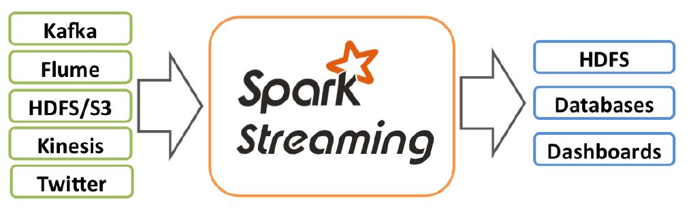
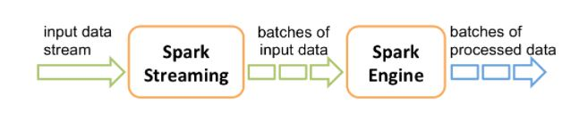

# Spark Streaming 

Spark Streaming is an extension of the core Spark API that enables
    - Scalable 
    - High-throughput
    - Fault-Tolerant   
  stream processing of live data streams. 
Data can be ingested from many sources life Kafka, Kinesis, or TCP Sockets.

### Quick Introductory Pointers 

> Use Cases 

- Twitter needs to crunch few billion tweets/s to publish trending topics.
- Credit Card companies needs to crunch millions of transactions/s for identifying fraud
- Mobile Applications like Whatsapp needs to contantly crunch logs for service availability and performance.   

> Real Time Analytics
- Ability to collect and process TB's of streaming data to get insights
- Data will be consumed from one or more streams
- Need for combining historical data with real time data 
- Ability to stream data for downstream applications

> Stream processing Using MapReduce 
- MR is inherently batch processing system which is not suitable for streaming. 
- Need for data source as disk put latencies in the processing
- Stream needs multiple transformation which cannot be expressed effectively on M/R
- OVerhead in launch of a new M/R job is too high. 

> Apache Storm 
- Apache storm is a stream processing system built on top of HDFS 
- Apache storm has it's on API's and do not use Map/Reduce
- It's a one message at time in core and micro batch is built on top of it(trident)
- Built by Twitter

> Limitations of Streaming On Hadoop 
- M/R is not suitable for streaming 
- Apache Storm needs learning New API's and new paradigm
- No way to combine batch rsult from M/R with Apache Storm Streams 
- Maintaining two runtimes are always hard 

### Spark Streaming Architecture 
Spark Streaming is an extension of the core Spark API that enables scalable, high-throughput, fault-tolerant stream processing of live data streams. Data can be ingested from many sources like Kafka, Kinesis, or TCP sockets, and can be processed using complex algorithms expressed with high-level functions like map, reduce, join and window. 
Finally, processed data can be pushed out to filesystems, databases, and live dashboards. 
In fact, you can apply Spark’s machine learning and graph processing algorithms on data streams.

Spark Streaming is an extension of the core Spark API that enables scalable, high-throughput, fault-tolerant stream processing of live data streams. Data can be ingested from many sources like Kafka, Kinesis, or TCP sockets, and can be processed using complex algorithms expressed with high-level functions like map, reduce, join and window. Finally, processed data can be pushed out to filesystems, databases, and live dashboards. In fact, you can apply Spark’s machine learning and graph processing algorithms on data streams.

Spark Streaming provides a high-level abstraction called discretized stream or DStream, which represents a continuous stream of data. DStreams can be created either from input data streams from sources such as Kafka, and Kinesis, or by applying high-level operations on other DStreams. Internally, a DStream is represented as a sequence of RDDs.

### More On
[Spark Streaming Guide](https://spark.apache.org/docs/latest/streaming-programming-guide.html)